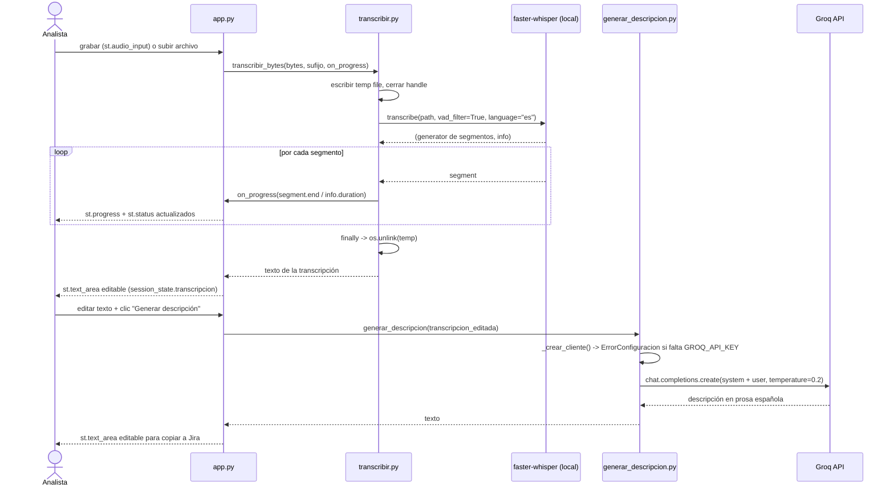

# Design: Voice Assistant for Analysts — Fase 1

## Technical Approach

Three root-level Python modules, one direction of dependency: `app.py` (Streamlit shell) → `transcribir.py` and `generar_descripcion.py`. Neither domain module imports `streamlit`, so both satisfy the "Module Testability" requirement in each spec. Progress for multi-minute audio comes from iterating `faster-whisper`'s **segment generator** and invoking a caller-supplied `on_progress` callback — the UI concern (`st.status` / `st.progress`) stays in `app.py`. `generar_descripcion.py` owns the whole prompt template so Fase 3 tuning and Fase 2 retrieval land in one file each.

## Architecture Decisions

### Decision: Progress via streaming segment generator, not a worker thread

| Option | Tradeoff | Decision |
|---|---|---|
| Iterate `model.transcribe()` segment generator, call `on_progress(segment.end / info.duration)` | Real percentage; deltas flush from the script thread as they happen; zero concurrency | **Chosen** |
| `threading.Thread` + `add_script_run_ctx` + polling `st.rerun` | Needs Streamlit-internal context plumbing; rerun churn; state loss risk | Rejected |
| `st.spinner` only | Indeterminate — a 6-minute wait looks stalled, violating "Transcription in progress" scenario | Rejected |

**Rationale**: `transcribe()` is lazy — work happens on iteration, so the loop *is* the progress hook. `segment.end` stays on the original timeline even with VAD, so `segment.end / info.duration` is a valid fraction.

### Decision: `vad_filter=True` by default

**Choice**: `transcribe(..., vad_filter=True, language="es", beam_size=1)`; `WhisperModel("base", device="cpu", compute_type="int8")`.
**Alternatives**: no VAD (full wall-clock cost on silence); `compute_type="float32"` (2-3x slower on CPU).
**Rationale**: Analyst recordings contain long pauses; VAD removes them from decode. `int8` is the standard CPU quantization for `base`. Exposed as a parameter so it can be disabled if VAD clips quiet speech.

### Decision: `transcribir.py` owns the temp file, not `app.py`

**Choice**: `transcribir_bytes()` writes bytes to a `NamedTemporaryFile(delete=False)`, closes the handle, transcribes, and unlinks in a `finally`.
**Alternatives**: temp file managed in `app.py` (cleanup duplicated across the record and upload paths, and skipped on exception).
**Rationale**: one `finally` guarantees both cleanup scenarios in the spec. The handle must be **closed before** faster-whisper opens it — Windows forbids reopening an open temp file.

### Decision: Groq client injected, never constructed at import

**Choice**: `generar_descripcion(transcripcion, cliente=None)`; `None` triggers `_crear_cliente()`, which raises `ErrorConfiguracion` when `GROQ_API_KEY` is absent/blank — before any network call.
**Alternatives**: module-level client (import fails without the unprovisioned key); `monkeypatch` of the `groq` package in tests (couples tests to SDK internals).
**Rationale**: the key is a known blocker. Injection lets every unit test run today with a fake client and satisfies "fail fast" without a stack trace.

## Data Flow

    audio bytes ──→ transcribir.py ──→ transcript (st.session_state)
                    (temp file, VAD,        │ editable
                     on_progress cb)        ▼
                                    generar_descripcion.py ──→ Groq ──→ description
                                    (prompt template, injected client)      │ editable



## File Changes

| File | Action | Description |
|---|---|---|
| `app.py` | Create | Streamlit shell: `load_dotenv()`, audio input + upload fallback, `st.status`/`st.progress` callback, two `st.text_area` boxes backed by `st.session_state`, maps module exceptions to `st.error` |
| `transcribir.py` | Create | Lazy model singleton, `transcribir_archivo`, `transcribir_bytes`, `verificar_dependencias`, `ErrorDependenciaAudio`, `ErrorTranscripcion` |
| `generar_descripcion.py` | Create | `SYSTEM_PROMPT`, `PLANTILLA_USUARIO`, `MODELO`, `_crear_cliente`, `generar_descripcion`, `ErrorConfiguracion`, `ErrorGeneracion` |
| `tests/test_transcribir.py` | Create | Temp-file lifecycle + progress callback with a fake model |
| `tests/test_generar_descripcion.py` | Create | Fake Groq client, prompt content assertions, missing-key fail-fast |
| `requirements.txt` | Create | `streamlit>=1.40` (`st.audio_input` floor), `faster-whisper>=1.0.3`, `av>=12`, `groq>=0.11`, `python-dotenv`, `pytest` |
| `.gitignore` | Create | `.env`, `__pycache__/`, `.venv/`, `*.wav` |
| `.env.example` | Create | `GROQ_API_KEY=` (empty placeholder, never a real value) |
| `CLAUDE.md` | Modify | Fill Python/Streamlit placeholders: run command, ports, pre-push check |

## Interfaces / Contracts

```python
# transcribir.py
ProgresoCallback = Callable[[float], None]  # 0.0..1.0

class ErrorDependenciaAudio(RuntimeError): ...   # av/ffmpeg ausente
class ErrorTranscripcion(RuntimeError): ...      # decode o inferencia falló

def verificar_dependencias() -> None: ...
def transcribir_archivo(ruta: str, *, on_progress: ProgresoCallback | None = None,
                        idioma: str = "es", vad: bool = True) -> str: ...
def transcribir_bytes(datos: bytes, sufijo: str = ".wav", *,
                      on_progress: ProgresoCallback | None = None) -> str: ...
```

```python
# generar_descripcion.py
MODELO = "llama-3.3-70b-versatile"

class ErrorConfiguracion(RuntimeError): ...  # GROQ_API_KEY ausente/vacía
class ErrorGeneracion(RuntimeError): ...     # fallo de API / clave inválida

def generar_descripcion(transcripcion: str, *, cliente=None,
                        modelo: str = MODELO) -> str: ...
```

### Groq prompt template (exact structure)

`temperature=0.2`, `max_tokens=1024`. Low temperature is part of the anti-invention control, not a tuning knob.

```python
SYSTEM_PROMPT = """Eres un asistente que redacta descripciones de incidencias para tickets de Jira, en español.

Reglas obligatorias:
1. Escribe en prosa libre en español. Sin secciones, títulos, viñetas ni plantillas.
2. Usa lenguaje llano, comprensible para una persona no técnica.
3. Usa ÚNICAMENTE la información presente en la transcripción. No inventes datos.
4. PROHIBIDO mencionar o suponer detalles de implementación (nombres de clases, funciones, métodos, tablas, endpoints, consultas SQL) que no aparezcan literalmente en la transcripción.
5. PROHIBIDO diagnosticar la causa técnica. Describe solo el comportamiento observado: qué hacía la persona, qué esperaba y qué ocurrió.
6. Si un dato no está en la transcripción (versión, usuario, entorno, pasos exactos), omítelo; no lo supongas ni pongas marcadores de posición.
7. Responde solo con la descripción, sin preámbulos ni markdown."""

PLANTILLA_USUARIO = """Transcripción del analista:
---
{transcripcion}
---
Redacta la descripción."""
```

Rules 3-6 implement the spec's "Plain-Language, Non-Technical Output" requirement. The `---` delimiters bound the transcript so spoken words are never read as instructions. Fase 2 inserts retrieved module context as an additional delimited block plus a "ground yourself in this context" rule; nothing else changes.

## Error Handling

| Condition | Detection | Behavior |
|---|---|---|
| `av`/ffmpeg missing | `verificar_dependencias()` — `importlib.util.find_spec("av")` before load | `ErrorDependenciaAudio` with install instructions → `st.error`, no traceback |
| Decode failure of a valid-looking upload | `except Exception` around `transcribe()`, re-raised typed | `ErrorTranscripcion`; temp file still unlinked |
| `GROQ_API_KEY` absent/blank | `os.environ.get("GROQ_API_KEY", "").strip()` in `_crear_cliente()` | `ErrorConfiguracion` before any HTTP call |
| Key present but rejected | Groq SDK auth/API exception caught | `ErrorGeneracion` with a generic message; **key value never interpolated** into messages, logs, or UI |
| Empty transcript | Guard in `app.py` before calling | Button disabled / warning; no API call |

## Testing Strategy

| Layer | What to Test | Approach |
|---|---|---|
| Unit — transcription | temp file deleted on success **and** on exception; `on_progress` receives monotonic 0..1; missing `av` raises `ErrorDependenciaAudio` | Fake model object returning a canned `(segments, info)` tuple injected via the model-loader seam; `tmp_path` + `monkeypatch` |
| Unit — generation | `ErrorConfiguracion` when key unset (`monkeypatch.delenv`); prompt contains rules 4-5 and the transcript verbatim; `MODELO` sent; returned content unwrapped | `FakeGroq` object exposing `chat.completions.create` recording kwargs — **no real network call** |
| Integration | Real `base` model over a short fixture WAV | `pytest -m slow`, opt-in (weights download) |
| Manual E2E | Multi-minute recording → visible progress → generation → copy to Jira | **Blocked** until `GROQ_API_KEY` is provisioned |

## Threat Matrix

N/A — no routing, shell commands, subprocess spawning, VCS/PR automation, executable-file classification, or process integration. Audio decode runs in-process through PyAV bindings, not a shell `ffmpeg` invocation. The one untrusted input (uploaded file bytes) is written to an OS temp path with a fixed suffix and never passed to a shell.

## Migration / Rollout

No migration required. All files are additive at repo root; rollback is `git revert` of the single PR.

## Open Questions

- [ ] `GROQ_API_KEY` is not provisioned — unit tests pass with the fake client, but end-to-end verification cannot complete until it exists.
- [ ] `st.audio_input` requires Streamlit >= 1.40; `app.py` guards with `hasattr(st, "audio_input")` and always renders the upload fallback. Confirm the analyst's local Streamlit meets the floor at install time.
