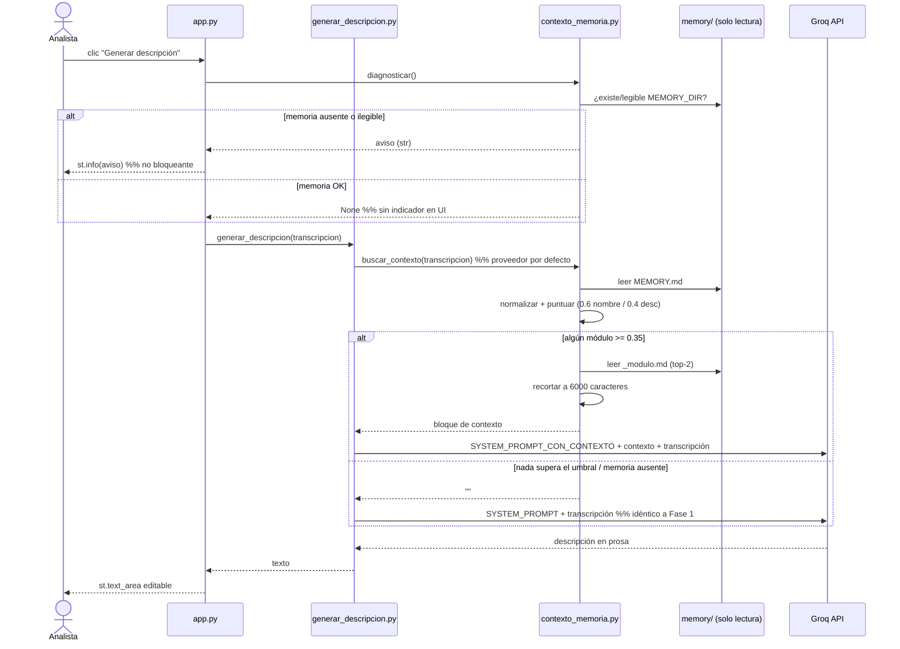

# Design: Module Context Retrieval — Fase 2

## Technical Approach

One new root-level domain module, `contexto_memoria.py`, added to the Fase 1 topology (`app.py` → domain modules, never the reverse; no domain module imports `streamlit`). It reads `MEMORY_DIR`, parses the `MEMORY.md` module index, scores each module against the transcript with stdlib-only lexical matching, and returns the concatenated `_modulo.md` text of the top matches under a character budget — or `""`.

It plugs into `generar_descripcion.py` through the **same seam as the Groq client**: an optional keyword argument defaulting to `None`, resolved lazily to the real implementation inside the function. `cliente` is an injected object; `proveedor_contexto` is an injected *function* (Strategy as a callable, no class hierarchy).

## Pinned Values

| Constant | Value | Derivation |
|---|---|---|
| `TOP_N` | `2` | One incident usually touches one module; a second covers adjacent modules (riesgos + planes de acción). Three dilutes grounding and doubles the invention surface. |
| `UMBRAL` | `0.35` | An exact name/alias hit alone scores `0.60` (passes). Three matched description terms with no name hit scores `0.40` (passes). Two terms scores `0.27` (rejected). |
| `PESO_NOMBRE` / `PESO_DESCRIPCION` | `0.6` / `0.4` | A spoken module name/alias is the strongest signal; description overlap is corroboration and the only path for plain-language references. |
| `PISO_DIFUSO` | `0.80` | `difflib` ratios below 0.80 are noise on short Spanish words ("riesgos"/"registros"); below the floor the name score is forced to `0.0`, so unrelated modules have a true zero, not a floating baseline. |
| `SATURACION_DESCRIPCION` | `3` | Description credit saturates at 3 matched content terms, so long descriptions are not penalised and one generic shared word cannot carry a match. |
| `PRESUPUESTO_CARACTERES` | `6000` | See below. |

**Character budget derivation.** `llama-3.3-70b-versatile` on Groq exposes a **131,072-token (128K) context window**; the window is not the binding constraint — the free-tier **12,000 TPM** rate limit is. Spanish averages ~3.5 chars/token. Budget: system prompt ≈ 500 tok + a 6-minute transcript ≈ 1,400 tok + context 6,000 chars ≈ 1,750 tok + `max_tokens=1024` output ≈ **4,700 tokens/request** — two full requests per minute inside the free tier, and ~3.6% of the context window. 6,000 chars fits two typical `_modulo.md` files whole; the budget is a guard rail, not a routine truncation.

## Architecture Decisions

### Decision: provider injected as a callable, `str` return, total function

**Choice**: `ProveedorContexto = Callable[[str], str]`; `generar_descripcion(transcripcion, *, proveedor_contexto=None, cliente=None, modelo=MODELO)`. `None` → lazy `from contexto_memoria import buscar_contexto`. `buscar_contexto` **never raises**: no match, missing folder and unreadable folder all return `""`.
**Alternatives**: passing a pre-fetched `contexto: str` from `app.py` (retrieval wiring leaks into the UI layer); a `ProveedorContexto` ABC with subclasses (a one-method interface with one implementation); a raising provider (an exception inside the generation call aborts a generation the spec says MUST still happen).
**Rationale**: mirrors the Fase 1 client seam exactly, so tests inject `lambda t: "texto fijo"` with zero filesystem or Streamlit. A total function keeps the failure mode "no context", never "no description".

### Decision: degrade notice comes from a separate health check, not a typed error

**Choice**: `diagnosticar(directorio=None) -> str | None` returns a Spanish notice when the memory root is missing/unreadable, else `None`. `app.py` calls it **inside the "Generar descripción" branch, before the spinner**, and renders `st.info(aviso)`. The typed `ErrorMemoria` exists and is raised only by the strict loader `cargar_modulos()`, consumed by `diagnosticar` and by tests.
**Alternatives**: the proposal's sketch — raise `ErrorMemoria` from retrieval and map it to `st.error` in `app.py`.
**Rationale**: the spec requires a **non-blocking** notice while generation proceeds; `st.error` reads as a failed operation and Fase 1 reserves it for aborted work (`st.info` is already the Fase 1 idiom for "capability unavailable, fallback in effect"). Placing the check in the button branch means it fires on a generation attempt, matching the spec's WHEN clause, instead of on every rerun. This supersedes the proposal's error-mapping sketch.

### Decision: stdlib `difflib`, no `rapidfuzz`

**Choice**: `difflib.SequenceMatcher` behind the 0.80 floor; `unicodedata.normalize("NFKD", ...)` for accent stripping.
**Alternatives**: optional `rapidfuzz` (proposal); embeddings/Chroma (Fase 5, out of scope).
**Rationale**: the fixture holds single-digit module counts, so C-speed fuzzy matching buys nothing measurable, and `requirements.txt` stays unchanged — one less thing to install on the analyst's machine.

### Decision: context rules are appended to the system prompt only when context exists

**Choice**: `SYSTEM_PROMPT` stays byte-identical to Fase 1; `SYSTEM_PROMPT_CON_CONTEXTO = SYSTEM_PROMPT + "\n\n" + REGLAS_CONTEXTO` is used only when the context block is non-empty.
**Alternatives**: one always-on prompt describing a block that may be absent.
**Rationale**: literally satisfies the spec's "byte-identical to Fase 1" no-match scenario, and rules about a block that does not exist are themselves an invention vector ("the context says…" with no context).

### Decision: no caching of the parsed index

**Choice**: re-read `MEMORY.md` and the matched `_modulo.md` on every call.
**Rationale**: the fixture is a few KB; an `lru_cache` would serve stale docs after an ops edit to a mounted `memory/` and add an invalidation bug for zero user-visible gain.

## Scoring Algorithm

```python
# normalización: NFKD -> quitar diacríticos -> minúsculas -> no-alfanumérico a espacio
# -> tokens de len >= 3 -> quitar stopwords ES (que, para, con, del, los, las, cuando,
#    donde, module/modulo, usuario, sistema, ...)

def puntuar(modulo, tokens_transcripcion) -> float:
    # 1) nombre/alias: carpeta (split en _ y -) + alias de MEMORY.md
    s_nombre = 0.0
    for alias in modulo.alias:                       # cada alias, 1..n tokens
        ratios = [max((SequenceMatcher(None, ta, tt).ratio() for tt in tokens_transcripcion),
                      default=0.0)
                  for ta in tokens(alias)]
        r = sum(ratios) / len(ratios)                # media sobre los tokens del alias
        s_nombre = max(s_nombre, r if r >= PISO_DIFUSO else 0.0)

    # 2) descripción: solapamiento saturado
    comunes = len(set(tokens(modulo.descripcion)) & tokens_transcripcion)
    s_desc = min(comunes, SATURACION_DESCRIPCION) / SATURACION_DESCRIPCION

    return PESO_NOMBRE * s_nombre + PESO_DESCRIPCION * s_desc
```

Ranking: sort by `(-score, nombre)` — the alphabetical tie-break makes the output reproducible in tests. Keep modules with `score >= UMBRAL`, take at most `TOP_N`.

**Worked example.** Transcript "el módulo donde se ven los riesgos no carga la matriz". Alias `riesgos` matches exactly → `s_nombre = 1.0`; description terms `{riesgos, matriz}` → `2/3 = 0.67`; score `0.6 + 0.267 = 0.867`. `auditorias_internas` has no alias hit and shares no content term → `0.0`.

**Truncation** (deterministic): append modules in rank order while the remaining budget allows; the module that overflows is cut at the last `\n` within the remaining budget (hard cut if none) and a lone line `[contenido truncado]` is appended. Blocks are joined with `\n\n`.

## Fixture `memory/` Structure

```
memory/
├── MEMORY.md                    # índice: nombre, alias, descripción por módulo
├── core/arquitectura.md         # nunca inyectado
├── errores_comunes.md           # nunca inyectado
├── decisiones_tecnicas.md       # nunca inyectado
└── modulos/
    ├── gestion_riesgos/_modulo.md
    ├── planes_accion/_modulo.md
    └── auditorias_internas/_modulo.md
```

`MEMORY.md` index line format — this **is** the cross-team contract with the real Kawak `memory/`:

```markdown
- **gestion_riesgos** (alias: riesgos, matriz de riesgos, mapa de riesgos) — Registro, valoración y seguimiento de riesgos institucionales por probabilidad e impacto.
```

Parsed by one regex: `^-\s*\*\*(?P<nombre>[^*]+)\*\*\s*(?:\(\s*alias\s*:\s*(?P<alias>[^)]*)\))?\s*[—-]\s*(?P<desc>.+)$`. Unparseable lines are skipped, never fatal. A folder under `modulos/` absent from `MEMORY.md` is still indexed with its folder name as the only signal; an index entry with no `_modulo.md` is skipped.

## Data Flow

    audio ─→ transcribir.py ─→ transcripción (editable, session_state)
                                      │
                     ┌────────────────┴────────────────┐
                     ▼                                 ▼
        contexto_memoria.diagnosticar()      generar_descripcion(transcripcion,
        (solo en el clic; None = OK)              proveedor_contexto=None)
                     │                                 │ lazy
                     ▼                                 ▼
              st.info(aviso)              contexto_memoria.buscar_contexto()
                                            MEMORY.md ─→ puntuar ─→ top-2 ≥ 0.35
                                            ─→ _modulo.md ─→ recorte a 6000 chars
                                                           │
                                                           ▼
                                            SYSTEM_PROMPT(_CON_CONTEXTO) + Groq



## File Changes

| File | Action | Description |
|---|---|---|
| `contexto_memoria.py` | Create | `Modulo`, `ErrorMemoria`, `resolver_directorio`, `cargar_modulos`, `puntuar`, `diagnosticar`, `buscar_contexto`, constants. No `streamlit`, no writes. |
| `generar_descripcion.py` | Modify | `proveedor_contexto` param + lazy default; `REGLAS_CONTEXTO`, `SYSTEM_PROMPT_CON_CONTEXTO`, `PLANTILLA_USUARIO_CON_CONTEXTO`. `SYSTEM_PROMPT` and `PLANTILLA_USUARIO` untouched. |
| `app.py` | Modify | `diagnosticar()` + `st.info` inside the "Generar descripción" branch, before the spinner. |
| `memory/MEMORY.md` + `memory/modulos/<3>/_modulo.md` + `core/`, `errores_comunes.md`, `decisiones_tecnicas.md` | Create | Dev/test fixture mirroring the real Kawak layout. |
| `tests/test_contexto_memoria.py` | Create | Scoring, threshold, top-N, truncation, degrade, read-only. |
| `tests/test_generar_descripcion.py` | Modify | Fake provider: with-context and no-context prompt assertions. |
| `.env.example`, `README.md`, `CLAUDE.md` | Modify | `MEMORY_DIR=`, `memory/` contract, run notes. |

`requirements.txt` is **unchanged** (stdlib-only retrieval).

## Interfaces / Contracts

```python
# contexto_memoria.py
ProveedorContexto = Callable[[str], str]          # transcripción -> bloque ("" = sin contexto)

TOP_N, UMBRAL, PRESUPUESTO_CARACTERES = 2, 0.35, 6000
PESO_NOMBRE, PESO_DESCRIPCION, PISO_DIFUSO, SATURACION_DESCRIPCION = 0.6, 0.4, 0.80, 3

@dataclass(frozen=True)
class Modulo:
    nombre: str; alias: tuple[str, ...]; descripcion: str; ruta: Path

class ErrorMemoria(RuntimeError): ...             # raíz ausente/ilegible (solo loader estricto)

def resolver_directorio(directorio: str | None = None) -> Path: ...   # MEMORY_DIR o ./memory
def cargar_modulos(directorio: str | None = None) -> list[Modulo]: ...  # puede lanzar ErrorMemoria
def puntuar(transcripcion: str, modulos: list[Modulo]) -> list[tuple[Modulo, float]]: ...
def diagnosticar(directorio: str | None = None) -> str | None: ...    # aviso o None
def buscar_contexto(transcripcion: str, *, directorio: str | None = None) -> str: ...  # nunca lanza
```

```python
# generar_descripcion.py
def generar_descripcion(transcripcion: str, *, proveedor_contexto: ProveedorContexto | None = None,
                        cliente=None, modelo: str = MODELO) -> str: ...

REGLAS_CONTEXTO = """Reglas adicionales para el bloque "Contexto de módulo":
8. El contexto es documentación interna de referencia. Úsalo SOLO para nombrar correctamente el módulo afectado y su comportamiento documentado.
9. La transcripción es la única fuente de los hechos del incidente. PROHIBIDO presentar contenido del contexto como algo que ocurrió, se observó o se hizo.
10. PROHIBIDO afirmar o insinuar cualquier cosa sobre el módulo que no aparezca literalmente en el bloque de contexto.
11. Si el contexto no concuerda con lo narrado en la transcripción, IGNÓRALO por completo y redacta únicamente desde la transcripción.
12. PROHIBIDO enumerar funcionalidades del módulo, copiar frases del contexto o mencionar que existe un contexto."""

SYSTEM_PROMPT_CON_CONTEXTO = SYSTEM_PROMPT + "\n\n" + REGLAS_CONTEXTO

PLANTILLA_USUARIO_CON_CONTEXTO = """Contexto de módulo (documentación interna, solo referencia):
===
{contexto}
===
Transcripción del analista:
---
{transcripcion}
---
Redacta la descripción. Los hechos salen solo de la transcripción; el contexto solo sirve para nombrar el módulo y su comportamiento documentado."""
```

`===` versus Fase 1's `---` keeps the two blocks unambiguous to the model. `temperature=0.2` and `max_tokens=1024` are unchanged.

## Path Safety

`MEMORY_DIR` is operator-supplied, not analyst-supplied. Reads are confined to `<raíz>/MEMORY.md` and `<raíz>/modulos/<carpeta>/_modulo.md`, where `<carpeta>` comes from `iterdir()` on the resolved root — never from the transcript, never joined from index text. Each candidate path is `resolve()`d and rejected unless it stays under the resolved root (symlink escape). Only `is_dir`, `iterdir`, `read_text` are used; no `open(..., "w"|"a"|"x")`, no `mkdir`, no `unlink`.

## Testing Strategy

| Layer | What to Test | Approach |
|---|---|---|
| Unit — retrieval | "donde se ven los riesgos" ranks `gestion_riesgos` first; unrelated transcript → `[]`; two qualifying modules both returned; tie-break alphabetical; accents/case ignored | `tmp_path` fixture tree + `monkeypatch.setenv("MEMORY_DIR", ...)` |
| Unit — budget | Oversized `_modulo.md` → output `<= 6000` chars, cut on a line boundary, `[contenido truncado]` present; within-budget content byte-identical | Generated fixture over the budget |
| Unit — degrade | Unset / missing / unreadable `MEMORY_DIR` → `buscar_contexto` returns `""` and never raises; `diagnosticar` returns a non-empty message | `monkeypatch.delenv`; `chmod`/patched `iterdir` raising `PermissionError` |
| Unit — read-only | No write occurs against the fixture | Snapshot `(path, size, mtime, sha256)` of the tree before/after, plus a `builtins.open` spy rejecting write modes |
| Unit — scope | Injected text never contains content from `core/`, `errores_comunes.md`, `decisiones_tecnicas.md`, `MEMORY.md` | Sentinel strings in those fixture files |
| Unit — generation | No-context call sends exactly the Fase 1 `SYSTEM_PROMPT` + `PLANTILLA_USUARIO`; with-context call sends `SYSTEM_PROMPT_CON_CONTEXTO` and the context inside `===`; provider injected as `lambda t: "..."` | Existing `FakeGroq` recorder; no network, no filesystem |
| Manual E2E | Analyst says a module name in plain language → description names that module | **Blocked** on `GROQ_API_KEY` |

## Threat Matrix

N/A — no routing, shell commands, subprocess spawning, VCS/PR automation, executable-file classification, or process integration. The one new boundary is a read-only filesystem read under an operator-supplied env path, covered by **Path Safety** above and its RED tests (symlink escape, write attempt).

## Migration / Rollout

No migration. Additive module + fixture + two small edits; rollback is `git revert` of the single PR. Runtime rollback without a deploy: point `MEMORY_DIR` at a non-existent path — retrieval returns `""`, the Fase 1 prompt is sent byte-identical, and the analyst sees only the notice.

## Open Questions

- [ ] The real Kawak `MEMORY.md` may not carry an `(alias: ...)` list; without aliases, plain-language references depend entirely on the saturated description overlap and recall drops. Confirm the index format with the owning team before wiring the real `memory/`.
- [ ] Groq free-tier TPM (12,000) is the binding limit, not the 128K window; if the account is on a paid tier the budget could be raised, but 6,000 chars is the safe default.
- [ ] `GROQ_API_KEY` still unprovisioned — end-to-end grounding quality cannot be measured yet.
